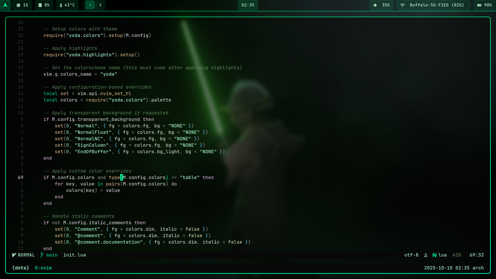

# Hyprland - Yoda




## Info

- **Operating System:** Arch Linux
- **Window Manager:** Hyprland
- **Status Bar:** Waybar
- **Widgets:** Eww (Elkowar's Wacky Widgets)
- **Launcher:** Wofi
- **Session Manager:** Swaylock + Swayidle
- **Notifications:** Mako
- **Terminal:** Alacritty
- **File Manager:** Thunar
- **Text Editor:** [Neovim(yoda.nvim)](https://github.com/kuri-sun/yoda.nvim)
- **Web Browser:** Google Chrome
- **Wallpaper Manager:** Hyprpaper
- **Input Method:** Fcitx5 (with Mozc for Japanese)

## Installation

If you want to install this setup on Arch Linux or any other distro, I recommend to run the master installation script:

```bash
# Complete installation - runs all scripts in order
bash ~/.config/scripts/install-master.sh
```

<details>
<summary><b>📦 Package Details (Click to expand)</b></summary>

**Core Hyprland & Wayland:**

> hyprland, hyprpaper, swayidle, swaylock, wl-clipboard, waybar, eww, wofi, mako

**Screen Capture & Recording:**

> grim, slurp, wf-recorder

**Terminal & Development:**

> alacritty, neovim, tmux, zsh, git, lazygit, htop, nodejs, npm, python-pip, go

**File Management:**

> thunar, thunar-volman, tumbler, gvfs, gvfs-mtp, gvfs-smb, gvfs-afc

**Audio:**

> pipewire, pipewire-alsa, pipewire-pulse, wireplumber, pavucontrol, pamixer, mpd, mpc

**Fonts:**

> ttf-jetbrains-mono, ttf-nerd-fonts-symbols, noto-fonts, noto-fonts-cjk, noto-fonts-emoji

**Input Method (Japanese):**

> fcitx5, fcitx5-mozc, fcitx5-gtk, fcitx5-qt, fcitx5-configtool

**Utilities:**

> brightnessctl, fastfetch, fzf, fd, ripgrep, unzip, wget, reflector

**System:**

> base, base-devel, linux, linux-firmware, grub, efibootmgr, networkmanager, ufw, gufw, intel-media-driver

</details>

## Packages

- `pkglist.txt` - Official Arch packages
- `aurlist.txt` - AUR packages

To update these lists after installing/removing packages:

```bash
bash ~/.config/scripts/update-package-lists.sh
```

## License

Freedom at will.
